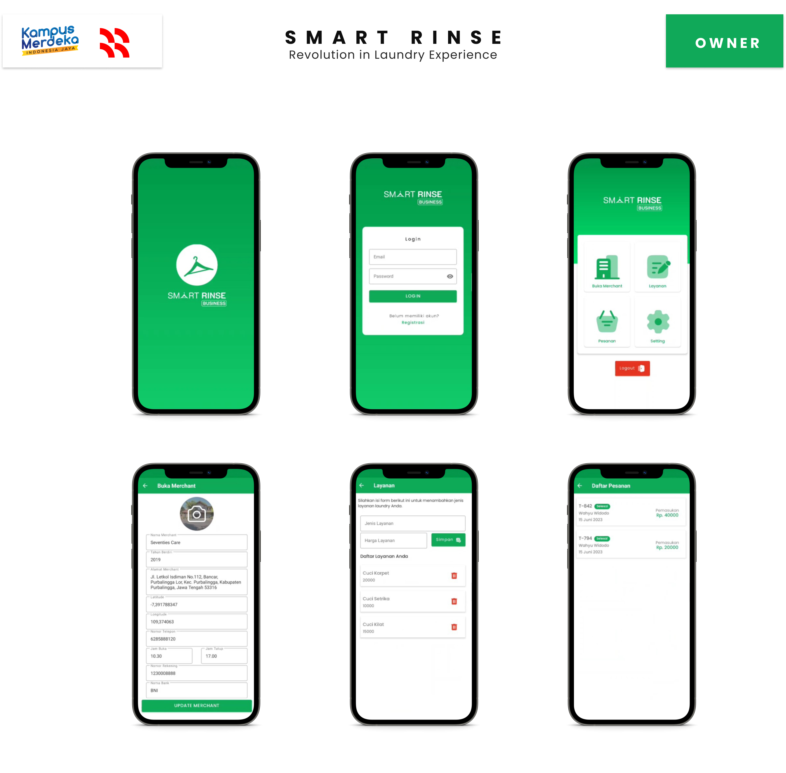

# Smart Rinse Business - Android Aplication

Smart Rinse Business is an application that can be used by merchant owners to manage their laundry services. Owners can manage merchants, manage their services, and manage incoming orders.

## Features

The android app lets you:
- Manage laundry merchants.
- Manage the types of services available.
- Manage incoming orders.
- Manage the owner's profile.

## Screenshots

## Permissions

The minimum Android version that can use this app is Android 5.0, with the following permission requests:
- Internet Access
- Camera or Gallery Access.

Internet access permissions are made to communicate data from the cloud and process laundry recommendations. Camera permissions are made to change profile and merchant photos.
